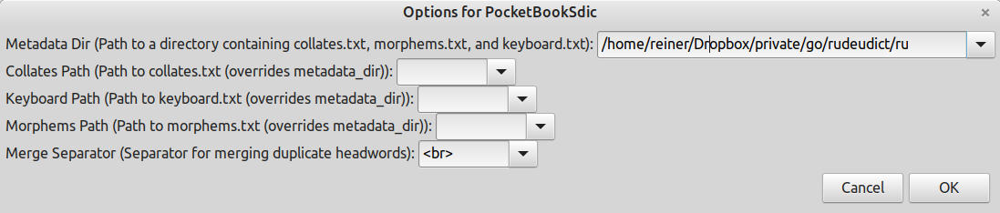
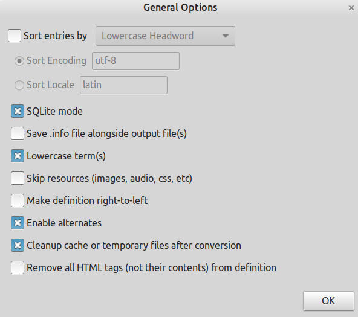

# ru_de_dict

Russian -> German dictionary.
Base format is XDXF. I also created with [PsyGlossary](https://github.com/ilius/pyglossary) a dict version
for my PocketReader.  
Pay attention to set the right settings:  
  

As data source I used the [OpenRussian Website] (https://de.openrussian.org/).  
~88000 words

Author: Reiner Pröls  
Licence: MIT  

### Files
[XDXF file](https://github.com/bytemystery-com/ru_de_dict/releases/download/v1.3/ru_de_openrussian.xdxf)  
[Dic file for PocketReader](https://github.com/bytemystery-com/ru_de_dict/releases/download/v1.3/ru_de_openrussian.dic)  

© Copyright Reiner Pröls, 2026

